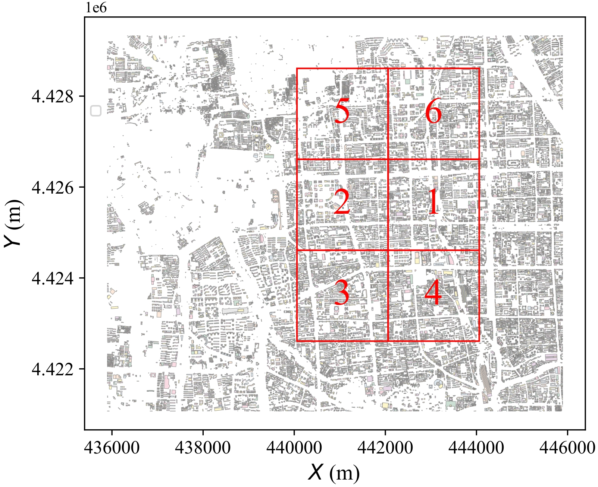

# Resource allocation for UAV-enabled spatio-temporal crowdsourcing with different city topologies

    This document showcases a series of 2D and 3D dynamic animations representing resource allocation for UAV-enabled spatio-temporal crowdsourcing over six urban areas.

## Overview Image

    

<!--  -->

This overview image displays the six regions where the UAV flights were recorded. Each region is marked with a number and will be detailed further in the following sections.

## City Area One 

### 2D Animation (100 times slots)

    

### 3D Animation (100 times slots)

    

 

## City Area TWO

### 2D Animation (100 times slots)

### 3D Animation (100 times slots)

## City Area Three

### 2D Animation (100 times slots)

### 3D Animation (100 times slots)

## City Area Four

### 2D Animation (100 times slots)

### 3D Animation (100 times slots)

## City Area Five

### 2D Animation (100 times slots)

### 3D Animation (100 times slots)

## City Area Six

### 2D Animation (100 times slots)

### 3D Animation (100 times slots)
